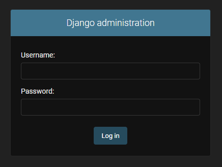
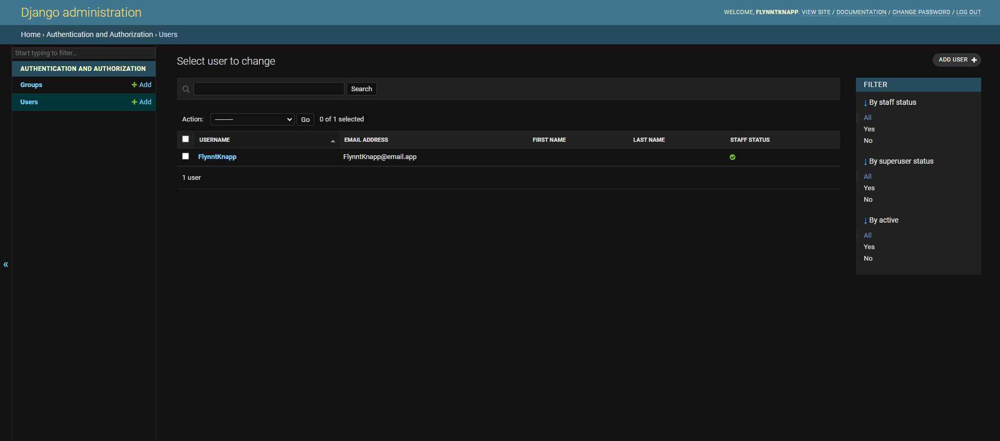
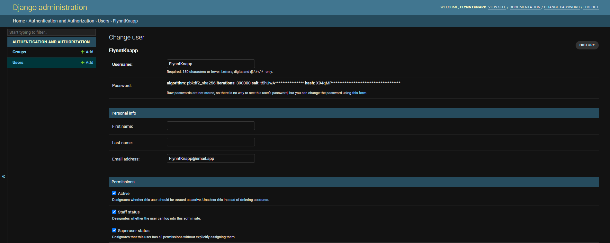
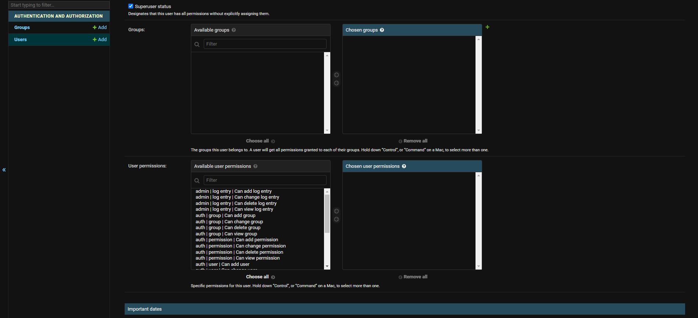
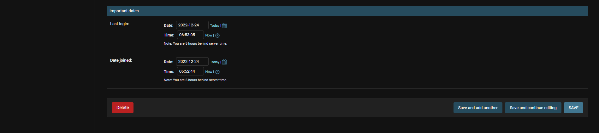

# Add Django AdminDocs (`django.contrib.admindocs`) Application

1. Start in root directory of project (the directory that will contain all of project code and our `manage.py`) and `Pipfile` and `Pipfile.lock` are in our current directory:
    * `pwd`
    * My sample directory:

        ```console
        PS C:\Users\FlynntKnapp\Programming\02-django-admin-documentation-generator> pwd

        Path
        ----
        C:\Users\FlynntKnapp\Programming\02-django-admin-documentation-generator

        PS C:\Users\FlynntKnapp\Programming\02-django-admin-documentation-generator>
        ```

    * `ls`
    * My sample directory contents:

        ```console
        PS C:\Users\FlynntKnapp\Programming\02-django-admin-documentation-generator> ls

            Directory: C:\Users\FlynntKnapp\Programming\02-django-admin-documentation-generator

        Mode                 LastWriteTime         Length Name
        ----                 -------------         ------ ----
        d----          12/18/2022 11:18 AM                config
        d----          12/18/2022 10:02 AM                images
        d----          12/18/2022 10:02 AM                notes
        d----          12/18/2022 11:13 AM                process
        -a---          12/17/2022 10:16 PM           7739 .gitignore
        -a---          12/18/2022 11:19 AM              0 db.sqlite3
        -a---          12/18/2022 11:18 AM            684 manage.py
        -a---          12/18/2022 11:16 AM            176 Pipfile
        -a---          12/18/2022 11:16 AM           2089 Pipfile.lock
        -a---          12/18/2022 11:25 AM            147 README.md

        PS C:\Users\FlynntKnapp\Programming\02-django-admin-documentation-generator>
        ```

1. Verify `docutils` is not installed:
    * `pip list`
    * Sample console output:

        ```console
        PS C:\Users\FlynntKnapp\Programming\02-django-admin-documentation-generator> pip list
        Package    Version
        ---------- -------
        asgiref    3.5.2
        Django     4.1
        pip        22.3.1
        setuptools 65.6.3
        sqlparse   0.4.3
        tzdata     2022.7
        wheel      0.38.4
        PS C:\Users\FlynntKnapp\Programming\02-django-admin-documentation-generator>
        ```

1. Install 'docutils' so we can use Django Admin Documentation:
    * `pipenv install docutils==0.19`
    * Sample console output:

        ```console
        PS C:\Users\FlynntKnapp\Programming\02-django-admin-documentation-generator> pipenv install docutils==0.19
        Installing docutils==0.19...
        Pipfile.lock (c21913) out of date, updating to (c92a4c)...
        Locking [packages] dependencies...
        Locking [dev-packages] dependencies...
        Updated Pipfile.lock (ad87035279ad7566fef0860964cc374ccfb9336924ab64f936c86c7a98c92a4c)!
        Installing dependencies from Pipfile.lock (c92a4c)...
        PS C:\Users\FlynntKnapp\Programming\02-django-admin-documentation-generator>
        ```

1. Verify `docutils` is installed. Note line with '`docutils`':
    * `pip list`
    * Sample console output:

        ```console
        PS C:\Users\FlynntKnapp\Programming\02-django-admin-documentation-generator> pip list
        Package    Version
        ---------- -------
        asgiref    3.5.2
        Django     4.1
        docutils   0.19
        pip        22.3.1
        setuptools 65.6.3
        sqlparse   0.4.3
        tzdata     2022.7
        wheel      0.38.4
        PS C:\Users\FlynntKnapp\Programming\02-django-admin-documentation-generator>
        ```

1. Add `django.contrib`'s `admindocs` app to `INSTALLED_APPS` list in [`config/settings.py`](../config/settings.py):

    ```python
    INSTALLED_APPS = [
        #...
        'django.contrib.admindocs',
        #...
    ]
    ```

1. Add URL path for `admindocs` app to `urlpatterns` list in [`config/urls.py`](../config/urls.py):

    NOTE: Make sure to add the `admindocs` URL path **before**/**above** the `admin` URL path.

    ```python
    urlpatterns = [
        #...
        path('admin/doc/', include('django.contrib.admindocs.urls')),
        path('admin/', admin.site.urls),
        #...
    ]
    ```

1. For the above URL `path` to function properly, we need to import `include` from `django.urls` in [`config/urls.py`](../config/urls.py):

    1. Add import of `include` to the import line for `path`:

        ```python
        #...
        from django.urls import path, include
        #...
        ```

1. Create the database by using `migrate`. This will allow us to create a superuser in next step and access Django Admin Interface and Django Admin Documentation:
    * `python manage.py migrate`

        ```console
        PS C:\Users\FlynntKnapp\Programming\02-django-admin-documentation-generator> python manage.py migrate
        Operations to perform:
          Apply all migrations: admin, auth, contenttypes, sessions
        Running migrations:
          Applying contenttypes.0001_initial... OK
          Applying auth.0001_initial... OK
          Applying admin.0001_initial... OK
          Applying admin.0002_logentry_remove_auto_add... OK
          Applying admin.0003_logentry_add_action_flag_choices... OK
          Applying contenttypes.0002_remove_content_type_name... OK
          Applying auth.0002_alter_permission_name_max_length... OK
          Applying auth.0003_alter_user_email_max_length... OK
          Applying auth.0004_alter_user_username_opts... OK
          Applying auth.0005_alter_user_last_login_null... OK
          Applying auth.0006_require_contenttypes_0002... OK
          Applying auth.0007_alter_validators_add_error_messages... OK
          Applying auth.0008_alter_user_username_max_length... OK
          Applying auth.0009_alter_user_last_name_max_length... OK
          Applying auth.0010_alter_group_name_max_length... OK
          Applying auth.0011_update_proxy_permissions... OK
          Applying auth.0012_alter_user_first_name_max_length... OK
          Applying sessions.0001_initial... OK
        PS C:\Users\FlynntKnapp\Programming\02-django-admin-documentation-generator>
        ```

1. Create a superuser so we can log into Django Admin Interface and access Django Admin Documentation:

    NOTE: The superuser will be created with the username and password you specify.

    IMPORTANT: Never use `admin` as the username for an application in production.

    IMPORTANT: Never use weak passwords for an application in production.

    * `python manage.py createsuperuser --email admin@email.app --username admin`

        ```console
        PS C:\Users\FlynntKnapp\Programming\02-django-admin-documentation-generator> python manage.py createsuperuser --email admin@email.app --username admin
        Password: 
        Password (again): 
        This password is too common.
        Bypass password validation and create user anyway? [y/N]: y
        Superuser created successfully.
        PS C:\Users\FlynntKnapp\Programming\02-django-admin-documentation-generator>
        ```

1. Start the development server:
    * `python manage.py runserver`
    * Sample console output:

        ```console
        PS C:\Users\FlynntKnapp\Programming\02-django-admin-documentation-generator> python manage.py runserver
        Watching for file changes with StatReloader
        Performing system checks...

        System check identified no issues (0 silenced).
        December 18, 2022 - 13:05:32
        Django version 4.1, using settings 'config.settings'
        Starting development server at http://127.0.0.1:8000/
        Quit the server with CTRL-BREAK.
        ```

1. Open the Django Admin Interface URL in a browser:
    * <http://localhost:8000/admin/>
    * Note the URL we are directed to:
        * <http://localhost:8000/admin/login/?next=/admin/>
    * Sample browser image:
        
    * Sample console output:

        ```console
        [18/Dec/2022 13:05:59] "GET /admin/ HTTP/1.1" 302 0
        [18/Dec/2022 13:05:59] "GET /admin/login/?next=/admin/ HTTP/1.1" 200 2218
        ```

1. Log into the Django Admin Interface using credentials created for the superuser above.
    * Sample browser image:
        

1. Click the `Log in` button.
    * Sample browser image:
        
    * Sample console output:

      ```console
      [18/Dec/2022 08:05:42] "POST /admin/login/?next=/admin/ HTTP/1.1" 302 0
      [18/Dec/2022 08:05:42] "GET /admin/ HTTP/1.1" 200 3667
      ```

    * Note the current URL:
        * <http://localhost:8000/admin/>

1. Explore the links provided in the `AUTHENTICATION AND AUTHORIZATION` section of the Django Admin Interface.
    * Sample browser image:
        

1. Use the `Users` link to navigate to the current list of `Users` page.
    * Sample browser image:
        

1. Investigate the current list of `Users` in the database.
    * Note the current URL:
        * <http://localhost:8000/admin/auth/user/>
    * Sample browser image:
        
    * Sample console output:

        ```console
        [18/Dec/2022 13:34:50] "GET /admin/auth/user/ HTTP/1.1" 200 7587
        [18/Dec/2022 13:34:50] "GET /admin/jsi18n/ HTTP/1.1" 200 3343
        ```

1. If there is already a `User`, there should be, the `User` account you are using right now.
    * There is probably a `User` account with the following attributes:
        * Username: `admin`
        * Email address: `admin@email.app`
        * ID: `1`
    * Click the link for the `User` account '`admin`' you are using right now.
        * Note the URL to view this user account. This is a common pattern in Django list, detail, and change views:
            * <http://localhost:8000/admin/auth/user/1/change/>
        * Sample browser image:
            

1. Explore the fields/attributes of the `User` account you are using right now.
    * Sample browser images:
        
        
        

1. Add a `User` or two to the database.
    * Note the current URL:
        * <http://localhost:8000/admin/auth/user/add/>
    * Sample browser image:
        
    * Sample console output:

        ```console
        [18/Dec/2022 13:35:22] "GET /admin/auth/user/add/ HTTP/1.1" 200 7587
        [18/Dec/2022 13:35:22] "GET /admin/jsi18n/ HTTP/1.1" 200 3343
        ```

1. Explore the links provided in the [`DOCUMENTATION`](http://localhost:8000/admin/doc/) section of the Django Admin Interface.
    * Sample browser image:
        
    * Sample browser image:
        
    * Note the URL:
        * <http://localhost:8000/admin/doc/>
    * Sample console output:

        ```console
        [18/Dec/2022 13:36:05] "GET /admin/doc/ HTTP/1.1" 200 4247
        ```

1. Explore the links provided by the [`Models`](http://localhost:8000/admin/doc/models/) link:
    * Sample browser image:
        
    * Note the URL:
        * <http://localhost:8000/admin/doc/models/>
    * Sample console output:

        ```console
        [18/Dec/2022 13:37:02] "GET /admin/doc/models/ HTTP/1.1" 200 4850
        ```

1. Note the links provided for related models. [`auth.Group`](http://localhost:8000/admin/doc/models/auth.group/):
    * Sample browser image:
        

1. Explore the link for the [`User`](http://localhost:8000/admin/doc/models/auth.user/) model of the `Authentication and Authorization` `django.contrib.auth` application:
    * Sample browser image:
        
    * Sample console output:

        ```console
        [18/Dec/2022 13:37:17] "GET /admin/doc/models/auth.user/ HTTP/1.1" 200 6607
        ```

1. Check out all the `Fields` provided by the Django default `User` model:
    * Sample browser image:
        
    * NOTE: These fields can be accessed on Django tamplates since they are attributes of the built-in `user` context object. We will explore this in the next section.

1. Go back to the [`DOCUMENTATION`](http://localhost:8000/admin/doc/) section of the Django Admin Interface and explore the [`Tags`](http://localhost:8000/admin/doc/tags/) and [`Filters`](http://localhost:8000/admin/doc/filters/) links.

1. Use `CTRL+C` in terminal to stop the Django development server.

1. Proceed to next section.
