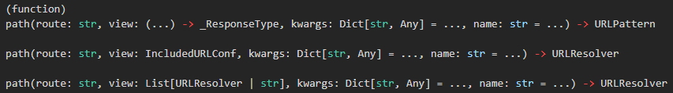

# Add User Login and Logout

## Background

* These code changes heavily rely on [Django Login and Logout Tutorial - learndjango.com](https://learndjango.com/tutorials/django-login-and-logout-tutorial). I can code these changes myself, but I will not be able to explain them as well as the author of the tutorial.
* Including user `login` and `logout` will make it easy to compare the `User` object for the `AnonymousUser` to an authenticated user.
* This tutorial will be using the `User` model from the `django.contrib.auth` app.
* This tutorial will be using the `login` and `logout` views from the `django.contrib.auth` app.

## Process

1. Start in project/repository root directory.

1. Activate the `pipev` virtual environment created in previous sections.
    * `pipenv shell`

1. Test the the development server still functions properly:
    * `python manage.py runserver`

1. Open internet browser to Django's Admin page and make sure it functions properly:
    * <http://localhost:8000/admin/>

1. Stop the development server.
    * `Ctrl+C`

1. NOTE: The `login` and `logout` views are already included in the `django.contrib.auth` app.
    * <https://docs.djangoproject.com/en/4.1/topics/auth/default/#module-django.contrib.auth.views>
    * With our choice of URL route of `accounts` the following URL patterns will be available:

        ```python
        accounts/login/ [name='login']
        accounts/logout/ [name='logout']
        accounts/password_change/ [name='password_change']
        accounts/password_change/done/ [name='password_change_done']
        accounts/password_reset/ [name='password_reset']
        accounts/password_reset/done/ [name='password_reset_done']
        accounts/reset/<uidb64>/<token>/ [name='password_reset_confirm']
        accounts/reset/done/ [name='password_reset_complete']
        ```

1. Add a URL `path()` to `urlpatterns` in [`config/urls.py`](../config/urls.py):
    * The `path()` function arguments will be:
        * route: `accounts/`
        * view: `include('django.contrib.auth.urls')`
            * An `IncludedURLConf` object
    * 

    ```python
    urlpatterns = [
        #...
        path('accounts/', include('django.contrib.auth.urls')),
        #...
    ]
    ```

1. Add a `path()` which uses `TemplateView` so we can render a template as a homepage:
    * The `TemplateView` class is a generic view that renders a template.
    * The `path()` function arguments will be:
        * route: `''`
        * view: `TemplateView.as_view(template_name='home.html')`
        * name: `'home'`

    ```python
    urlpatterns = [
        #...
        path('', TemplateView.as_view(template_name='home.html'), name='home'),
        #...
    ]
    ```

1. Add an import for `TemplateView` from `django.views.generic.base` to [`config/urls.py`](../config/urls.py):

    ```python
    from django.views.generic.base import TemplateView
    ```

1. We are going to create a `templates` directory in the project root directory in the next step and need to add a property to [`config/settings.py`](../config/settings.py) to tell Django where to look for templates.
    * Add the following property to `TEMPLATES` list in [`config/settings.py`](../config/settings.py):

        ```python
        TEMPLATES = [
            {
                #...
                'DIRS': [BASE_DIR / 'templates'],
                #...
            },
            #...
        ]
        ```

1. Create a new directory called `templates` in the project root directory.

1. Create a new file called `home.html` in the `templates` directory.

1. Add the following contents to the [`templates/home.html`](../templates/home.html) file:

    ```html
    

    Home

    

        <h2><code>user</code> Login Status</h2>
        
            <p>You are logged in, and you're: <code>{{ user }}</code></p>
            
                <a href="">Django Admin Interface</a>
            
            <p><a href="">Log Out</a></p>
        
            <p>You are not logged in, so you're: <code>{{ user }}</code></p>
            <p><a href=>Log In</a></p>
        

    
    ```

1. Create a new file called `base.html` in the `templates` directory.

1. Add the following contents to the [`templates/base.html`](../templates/base.html) file:

    ```html
    <!DOCTYPE html>
    <html lang="en">
    <head>
        <meta charset="UTF-8">
        <meta http-equiv="X-UA-Compatible" content="IE=edge">
        <meta name="viewport" content="width=device-width, initial-scale=1.0">
        <title>Django AnonymousUser - </title>
    </head>
    <body>

        <h1>Current <code>User</code>: <code>{{ user }}</code></h1>

        <h2>User Information</h2>
        <dl>
            <dt><code>user.is_anonymous</code></dt>
            <dd>{{ user.is_anonymous }}</dd>
            <dt><code>user.is_authenticated</code></dt>
            <dd>{{ user.is_authenticated }}</dd>
            <dt><code>user.is_staff</code></dt>
            <dd>{{ user.is_staff }}</dd>
            <dt><code>user</code></dt>
            <dd>{{ user }}</dd>
            <dt><code>user.username</code></dt>
            <dd>{{ user.username }}</dd>
        </dl>
        
        
        

    </body>
    </html>
    ```

1. Create a new directory called `registration` in the `templates` directory.

1. Create a new file called `login.html` in the `registration` directory.

1. Add the following contents to the [`templates/registration/login.html`](../templates/registration/login.html) file:

    ```html
    

    Login

    

        <nav>
            <p><a href=>Home</a></p>
        </nav>

        <h2>Log In</h2>
        <form method="post">
            
            {{ form.as_p }}
            <button type="submit">Log In</button>
        </form>

    
    ```

1. Add `LOGIN_REDIRECT_URL` and `LOGOUT_REDIRECT_URL` properties to [`config/settings.py`](../config/settings.py) to tell Django where to redirect the user after they log in and log out:

    ```python
    LOGIN_REDIRECT_URL = 'home'
    LOGOUT_REDIRECT_URL = 'home'
    ```

1. Proceed to [Explore User Attributes and URL Routes](./03_explore_user_attributes_and_url_routes.md) to explore properties of the `AnonymousUser` object and investigate URL routes for actions.
