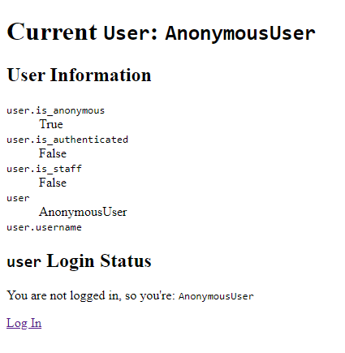
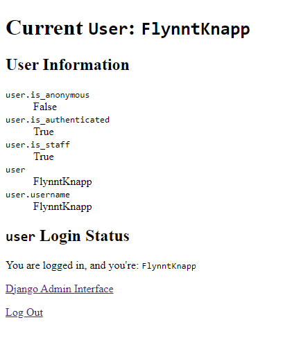

# Explore User Attributes and URL Routes

## Images

* Home page view for `AnonymousUser` object:

  

* Home page view for `User` object which has `is_authenticated` set to `True` and `is_staff` set to `True`:

  
